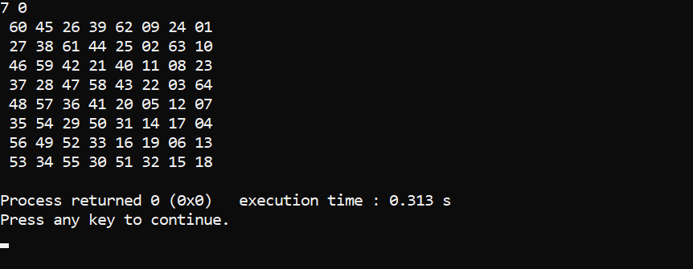

# Knights Tour

### The Knight's Tour Problem:
The knight chess piece has 8 possible moves. The challenge is to determine whether the knight can traverse the entire chessboard, visiting each square exactly once. This is known as the Knight's Tour Problem.

### Algorithm and Approach:
A depth-first search (DFS) algorithm (brute force approach) is used here to solve the problem through a recursive call stack, visualized as a tree structure, wherein we travel in a pre-order sequence and backtrack only when we've tried all 8 possible knight moves and found none were valid: either they were outside the board, or were all moves that would result in visiting already visited squares. 

  
The worst case for this algorithm is the case in which the knight must backtrack and then iterate through every 8 moves afterwards for each backtrack. Thus, more generally, the time complexity for DFS is exponential, O($$8^{N \times N}$$). While performance can widely vary depending on the starting position of the knight and considering other approaches that exist that can solve this problem in better time (e.g. Warnsdorff's heuristics rule, ANN, ...), the DFS approach still holds due to lending itself to being far more intuitive to implement (at least, personally speaking).
  
Since the program tries to find a Knight's Tour from a random starting position, it may take either a long time for a knight's tour to be found or effectively impossible (intractable).

### Implementation:
- A coordinate system is used to map where the knight is, what the boundaries of the board is, and the moves the knight can make
- By initializing the squares on the board with a value, a square can be determined to be visited or not by checking its value
- The recursive function call happeens in a helper function in an if-statement that expects a true value to be returned, which indicates a knight's tour was found and thus will print it when the recursive stack frames are completely popped off the stack
- In the recursive function, apply the knight's move on the current knight's X and Y coordinates to determine whether a knight move is valid; if it is valid, mark the square as visited (moveCounter) and continue making recursive calls in an if-statement, noting that one of the parameters is incremented each call indicating a knight's tour being built and a step towards the base base of 63
- If the knight move is invalid, that is, all 8 knight moves were tried and invalid, return a zero, indicating a backtrack, which will fail if-statement in which the recursive function call was made in to produce this recursive stack frame when it returns, thus going to the else statement where the grid is initialized back to unvisited
- Iterate through the loop to try the next knight move
- Repeat last 3 steps
- Once the base case is reached, remove the recursive stack frames by returning 1 each frame. The final return will transfer control back to the other function that called the recursive function
- Print knight's tour board

### Observations:
- The starting point greatly affects the runtime of a knight's tour and whether one can be found
- The order of moves checked can also greatly affect the runtime of a knight's tour and whether one can be found

### Program:
A console application: The first line is the starting position given in terms of x and y, where the coordinates begin from the top-left corner starting at 0, respectively. What's printed after this line is the board in terms of the number in the path in which the knight's tour was reached, provided one was found. You can safely assume after a minute or so that no knight's tour can be found from that starting position.

### Future Considerations
- Test the program's performance and display it
- Explore the other algorithms to solve the problem
- Add a graphical and user interface
